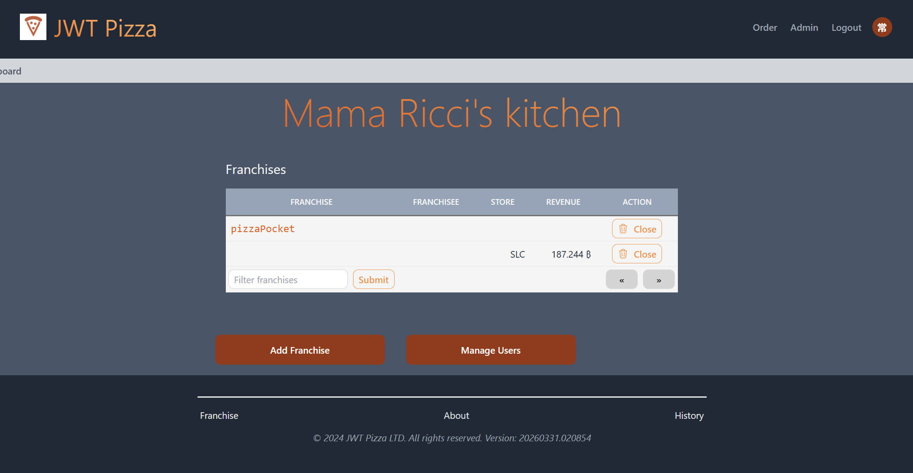
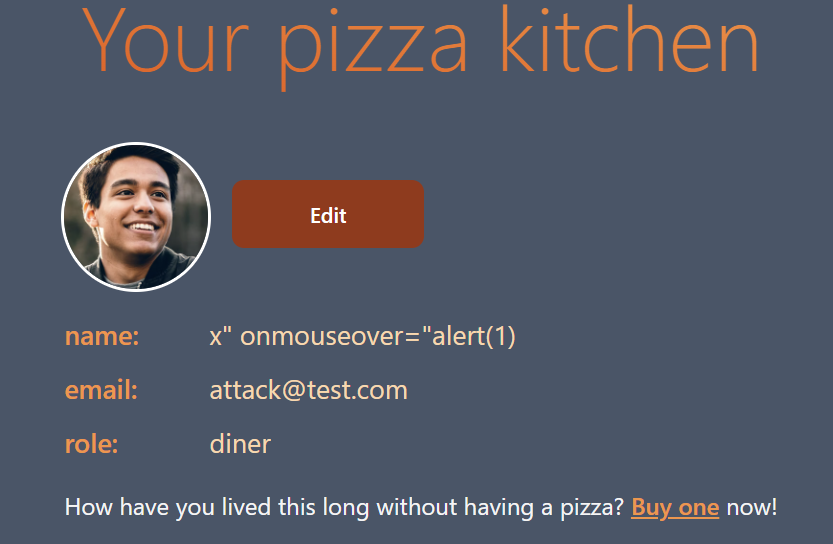
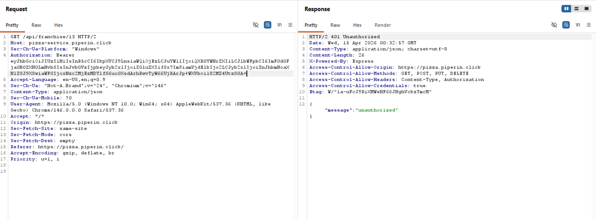
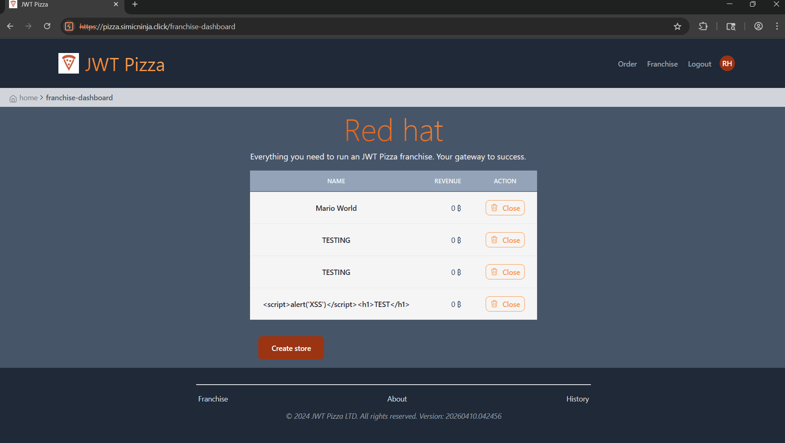
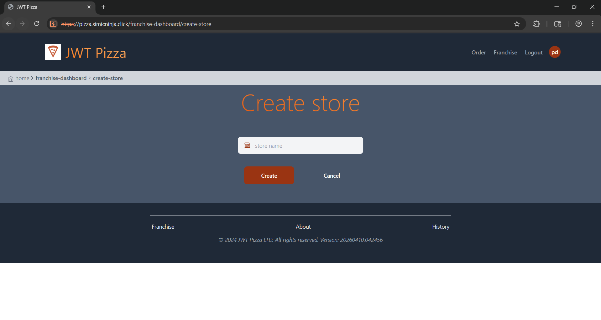
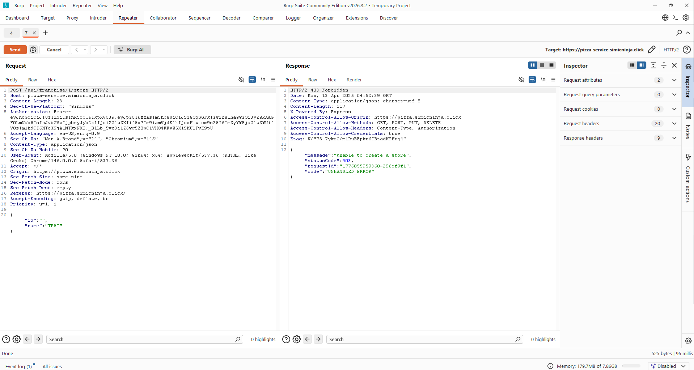
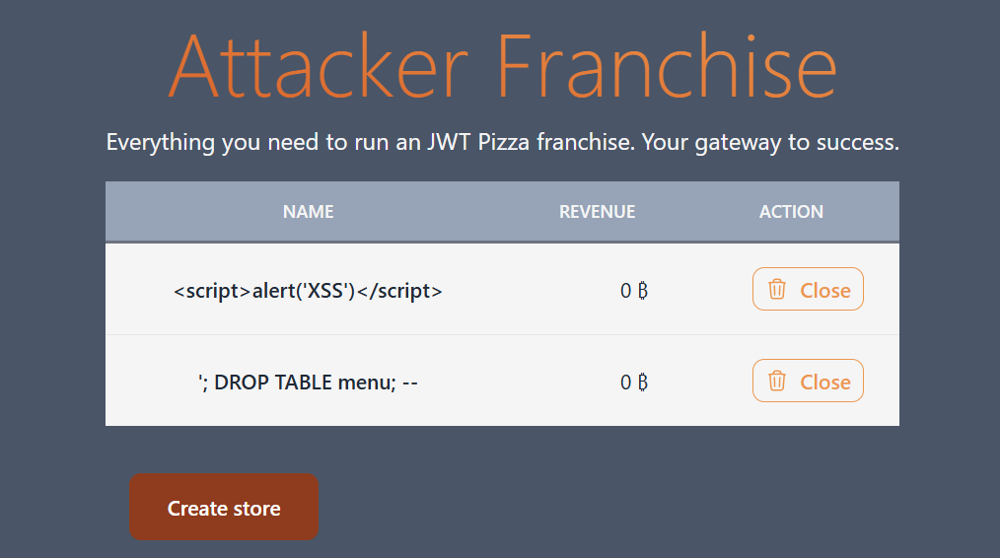

# Penetration Tests
____
Participants: Piper Dickson, Owen Werts     

## Self-Attacks
### Piper Dickson
|  Item         | Result  |
|---------------|---------|        
| Date          | April 9, 2026   |
| Target        | https://pizza.piperin.click |
| Classification| Injection  |
| Severity      | 0  |
| Description   | Injection attack failed, no tables dropped, no successful logins  |
| Images        |   |   
| Corrections   | None needed  |

|  Item         | Result  |
|---------------|---------|        
| Date          | April 9, 2026   |
| Target        | https://pizza.piperin.click  |
| Classification| Brute-force  |
| Severity      |  3 |
| Description   | Access to administrator privileges granted, franchises and user information at risk  |
| Images        |    |   
| Corrections   | Admin password adjusted to be more secure  |

|  Item         | Result  |
|---------------|---------|        
| Date          | April 9, 2026   |
| Target        | https://pizza.piperin.click  |
| Classification| Cross-site Scripting (XSS)  |
| Severity      | 0  |
| Description   | HTML tags and JavaScript references were sucessfully ignored by the application  |
| Images        |    |   
| Corrections   | None needed  |

|  Item         | Result  |
|---------------|---------|        
| Date          | April 9, 2026   |
| Target        | https://pizza.piperin.click  |
| Classification| Authentication Failure/Bypass  |
| Severity      |  0 |
| Description   | Auth token adjusted to include admin role for non-admin user, attempted to access edit users function with this token|
| Images        |    |   
| Corrections   |  None needed, authorization correctly denied even with admin role added |

|  Item         | Result  |
|---------------|---------|        
| Date          | April 9, 2026   |
| Target        | https://pizza.piperin.click  |
| Classification| Indirect Object Reference |
| Severity      |  0 |
| Description   |  Franchisee token adjusted to include objectID from non-owned franchisee. Application successfully denied request |
| Images        |   |   
| Corrections   |  None needed |

### **Owen Werts**
#### 1.Cross-Site Scripting (XSS)
|  Item         | Result  |
|---------------|---------|        
| Date          | April 9, 2026 |
| Target        | https://pizza.simicninja.click |
| Classification| Injection |
| Severity      | 0 |
| Description   | Attempted a stored XSS attack on the create store option for a franchisee. Attack failed and stored script was displayed as text. |
| Images        |  |
| Corrections   | None, since the attack failed. |

#### 2.URL Navigation Instead of GUI
|  Item         | Result  |
|---------------|---------|        
| Date          | April 12, 2026   |
| Target        | https://pizza.simicninja.click |
| Classification| Broken Access Control |
| Severity      | 1 |
| Description   | Basic users (without franchisee or admin roles) are able to access the webpage to create a store. Notably the API docs were completely open for public inspection and scrutiny giving potential threat actors valuable information. | 
| Images        |  |
| Corrections   | Created functions to test user role in app.tsx. Applied role constraints to following routes: Create Franchise, Close Franchise, Create Store, Close Store, Docs |

#### 3.Store Close & Open API Manipulation
|  Item         | Result  |
|---------------|---------|        
| Date          | April 12, 2026   |
| Target        | https://pizza.simicninja.click |
| Classification| Broken Access Control |
| Severity      | 0 |
| Description   | Attempted an attack to modify the id values used in the create store and close store APIs. Since API calls use simple integer IDs for the franchise and store, it is trivial to change the values to target stores not owned by the user even without admin prvileges. Attack confirmed that the API requires the POST and DELETE request to be made by the owner of the "store" object or an admin. |
| Images        |  |   
| Corrections   | No corrections made since the attack failed. |

#### 4.
|  Item         | Result  |
|---------------|---------|        
| Date          | April 12, 2026   |
| Target        | https://pizza.simicninja.click |
| Classification| Insecure Design |
| Severity      | 2 |
| Description   | Successfully manipulated the HTTP payment request to alter the prices of given items. Using Burp Suite or another tool for modifying requests makes the attack much easier, but it is technically executable with a simple web browser. The attack is possible due to the price being provided by the HTTP request from the user instead of a lookup from the database. |
| Images        |  |   
| Corrections   | Rewrote front and backend handling of orders so that prices are read directly from the database. |

**Owen Werts**
|  Item         | Result  |
|---------------|---------|        
| Date          | April 13, 2026   |
| Target        | https://pizza.simicninja.click |
| Classification|  |
| Severity      |  |
| Description   |  |
| Images        |  |   
| Corrections   |  |

## Peer Attacks
___
### Piper Dickson
|  Item         | Result  |
|---------------|---------|        
| Date          | April 14, 2026   |
| Target        | https://pizza.simicninja.click |
| Classification| Cross-site Scripting (XSS)|
| Severity      | 0 |
| Description   | Attempted manual cross-site scripting attacks via the franchise store creation page. This failed, and was one of the few places where user input was reflected on the application |
| Images        |   |   
| Corrections   | None needed |

|  Item         | Result  |
|---------------|---------|        
| Date          | April 14, 2026   |
| Target        | https://pizza.simicninja.click |
| Classification| Injection |
| Severity      | 0 |
| Description   | DROP TABLE injection attack attempted. Application properly sanitized inputs and no data was affected |
| Images        |   |   
| Corrections   | None needed |

|  Item         | Result  |
|---------------|---------|        
| Date          | April 14, 2026   |
| Target        | https://pizza.simicninja.click |
| Classification| Brute-force |
| Severity      | 3 |
| Description   | Access to administrator privileges granted through brute-force password attempts. User and franchise information now at risk |
| Images        |   |   
| Corrections   | Admin password should be adjusted to be more secure |

|  Item         | Result  |
|---------------|---------|        
| Date          | April 14, 2026   |
| Target        | https://pizza.simicninja.click |
| Classification| Indirect Object Reference  |
| Severity      | 0 |
| Description   | Modified token objectID to attempt to gain access to unauthorized franchise information. Request successfully denied, though via a 502 response. Attack failed. |
| Images        |   |   
| Corrections   | (Optional) modify application so that unauthorized requests return a 401 or 403 error rather than 502 |

|  Item         | Result  |
|---------------|---------|        
| Date          | April 14, 2026   |
| Target        | https://pizza.simicninja.click |
| Classification| Authentication Failure/Bypass |
| Severity      | 1 |
| Description   | Modified GET request for admin dashboard information to use diner token instead of admin token. Franchise information still returned despite improper permissions |
| Images        |  |   
| Corrections   | Proper admin check should be performed to block requests from unauthorized users |

### Owen Werts

## Combined Summary of Learnings